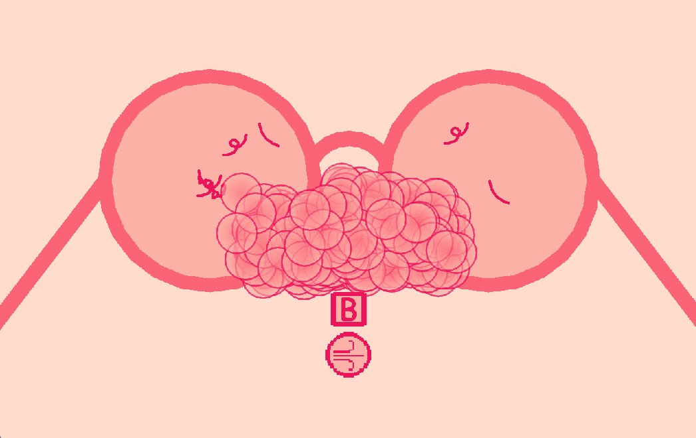

# GLASS GLEAM

**Glass** Gleam is an interactive digital toy built in GameMaker Studio 2. In this experience, you'll take on the simple yet satisfying task of cleaning a pair of glasses. Dust and eyelashes clutter the lenses, and it's your job to blow them away.

There’s no score or competition—just you, a pair of glasses, and the simple pleasure of making them shine again.

## Demo

Check out this YouTube [demo](https://youtu.be/x-Tw3W_rsQg) video to see Glass Gleam in action!

## Instructions

- Press `B` to BLOW on the dirty glasses and remove the debris.
- Press `SPACE` to RESTART the simulation once the glasses are fully clean.

## Instructions for Local Use

### Option A: Run on GameMaker Studio 2

#### Prerequisites

- Install [Steam](https://store.steampowered.com/about/download) and create an active Steam account.
- Install GameMaker Studio 2 on your machine via Steam.
- Ensure all necessary dependencies are properly installed and configured within GameMaker Studio 2.

#### Steps to Run Glass Gleam Locally

1. Clone this repository to your desired directory.
2. Open GameMaker Studio 2.
3. Select "Open Project" and navigate to the directory where the cloned repository is located.
4. Open the `GleamGlass.yyp` project file.
5. Run the project by clicking the play button within GameMaker Studio 2.
6. Enjoy!

### Option B: Run the Windows Build

1. Download the `GleamGlassWindows.zip` file.
2. Extract the downloaded `.zip` file.
3. Open the extracted folder and run the `GleamGlass.exe` application.
4. Enjoy!

## About

**Glass Gleam** is a minimalist, responsive toy designed to provide a moment of calm and satisfaction. The simple act of cleaning dirty glasses is transformed into an engaging experience through smooth controls and delightful visual feedback.

The project focuses on providing "game juice"—elements like shrinking and expanding sprites, particle effects, and the sparkling twinkle that marks the completion of your task. The attention to these subtle interactions makes **Glass Gleam** a charming and soothing digital toy.

Enjoy the journey from grime to gleam!

## Credits

- `fnt_dosis_semibold`: _Dosis_ designed by Impallari Type. Available at [this](https://fonts.google.com/specimen/Dosis?query=dosis) link.

## Contact

I’d love to hear from you! If you have any questions, feedback, or suggestions about **Glass Gleam**, feel free to reach out.

    Email: eviii.professional@gmail.com

Thank you for exploring **Glass Gleam**!
